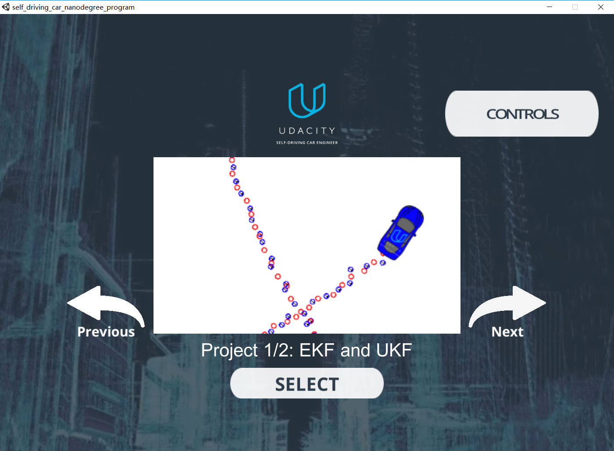
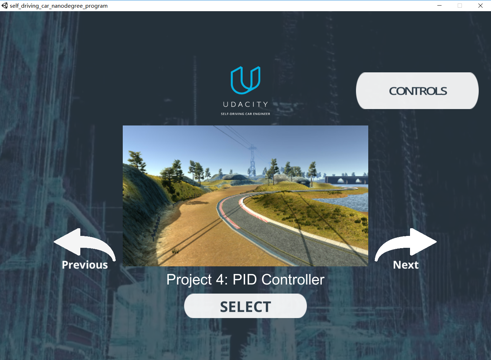

# CarND-PID-Control-P4
Udacity Self-Driving Car Nanodegree - PID Control project

# Overview

This project implements a [PID controller](https://en.wikipedia.org/wiki/PID_controller) and tune parameters, then test its performance in Udacity's simulator([Downloaded here](https://github.com/udacity/self-driving-car-sim/releases)). The simulator sends cross-track error, speed and steering angle to the PID controller(PID) using [WebSocket](https://en.wikipedia.org/wiki/WebSocket) and it receives the steering angle ([-1, 1] normalized) and the throttle value to drive the car reliably around the simulator track. 

# Prerequisites

The project has the following dependencies (from Udacity's seed project):

- cmake >= 3.5
- make >= 4.1
- gcc/g++ >= 5.4
- Udacity's simulator.

For instructions on how to install these components on different operating systems, please, visit [Udacity's seed project](https://github.com/udacity/CarND-PID-Control-Project). 

In order to install the necessary libraries, use the [install-ubuntu.sh](./install-ubuntu.sh).

# Compiling and executing the project

In order to build the project, we should first Make a build directory: `mkdir build && cd build`. Then compile the code: `cmake .. && make`.   This is an example of the ouput of this script:

```
cmake .. && make
>-- The C compiler identification is GNU 7.3.0
-- The CXX compiler identification is GNU 7.3.0
-- Check for working C compiler: /usr/bin/cc
-- Check for working C compiler: /usr/bin/cc -- works
-- Detecting C compiler ABI info
-- Detecting C compiler ABI info - done
-- Detecting C compile features
-- Detecting C compile features - done
-- Check for working CXX compiler: /usr/bin/c++
-- Check for working CXX compiler: /usr/bin/c++ -- works
-- Detecting CXX compiler ABI info
-- Detecting CXX compiler ABI info - done
-- Detecting CXX compile features
-- Detecting CXX compile features - done
-- Configuring done
-- Generating done
-- Build files have been written to: /home/yueyangdk/CarND-PID-Control-Project/build
Scanning dependencies of target pid
[ 33%] Building CXX object CMakeFiles/pid.dir/src/PID.cpp.o
[ 66%] Building CXX object CMakeFiles/pid.dir/src/main.cpp.o
[100%] Linking CXX executable pid
[100%] Built target pid
```

After making sure there is no error message, we can execute the project: `./pid`.

```
 ./pid
Listening to port 4567
```

Now the PID controller is running and listening on port 4567 for messages from the simulator. Next step is to open Udacity's simulator:



Using the right arrow, you need to go to the Project 4: PID Controller project:



Click the "Select" button, and the car starts driving. You will see the debugging information on the PID controller terminal. A short video with the final parameters is [./videos/final-parameters.mov](./video/final_param_video.mp4).


### Effect of the P, I, D components had in controller.

- The proportional portion of the controller have the most directly observable effect on the car's behavior. It causes the car to steer proportional (and opposite) to the distance between car and the lane center (which is the cross-track error). P control mainly decide the speed of the system respond. If used along, the car overshoots the central line very easily and go out of the road very quickly.

- The integral portion of the controller tries to eliminate a possible bias on the controlled system that could prevent the error to be eliminated. I control decides whether there will be a steady-state error. If used along, it makes the car to go in circles. 

- The differential portion of the controller helps to counteract the proportional trend to overshoot the center line by smoothing the approach to it. 

### Final Parameters

The parameters were chosen manually by try and error. First, make sure the car can drive straight with zero as parameters. Then add the proportional and the car start going on following the road but it starts overshooting go out of it. Then add the differential to try to overcome the overshooting. The integral part only moved the car out of the road; so, it stayed as zero. After the car drove the track without going out of it, the parameters increased to minimize the average cross-track error on a single track lap. The final parameters where [P: 1.5, I: 0.0, D: 2.5].

PID controller for steering were tuned manually at first.  Add the proportional and integral control to make the car start following the track. When it starts overshooting and go out of road, add differential control to smooth the steering process and revome overshoot. The final parameters(without throttle) are (P: 0.15, I: 0.0001, D: 3).

Then I implemented a PID controller for the throttle, to maximize the car's speed around the track. The throttle PID controller is fed the magnitude of the CTE because it doesn't make sense when fed a negative value. For this reason the throttle controller doesn't include an I component, which would only grow indefinitely. The throttle controller was fine-tuned using Twiddle, simultaneously with the steering controller.

### Twiddle

I implement Twiddle to automate parameter optimization process. However, it needs to have a set of parameters that make sure the car would not leave the road, which will invalidating the optimization. Once found parameters that were able to get the car around the track reliably, Twiddle is ready to work. It is necessary to complete at least a full lap with each change in parameter because the optimization process needs many steps to try if a change in parameter actully works. Also, I treat it as a LTI  system and set the settling state and the evaluation state for the process. The error used to optimize parameter is caculated in the evaluation state only because the error in settling state is very large and not helpful to evaluating performance. In all, I allowed Twiddle to continue for over 1 million steps (or roughly 500 trips around the track) to fine tune the parameters. The final values for steering PID controller is (P: 0.134611, I: 0.000270736, D: 3.05349) and for throttle PID controller is (P: 0.362221, I: 0, D: 0.116545)

## Simulation


A short video with the final parameters is [./videos/final-parameters.mov](./videos/final_param_video.mp4).
